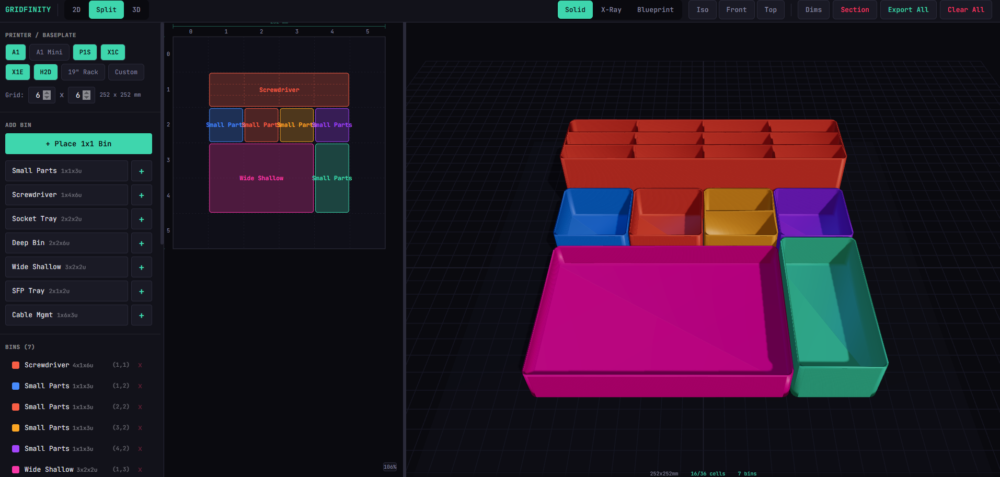
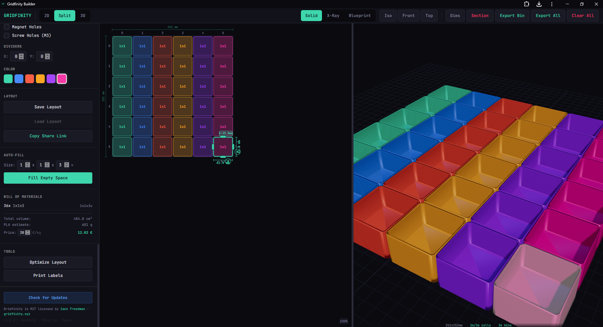
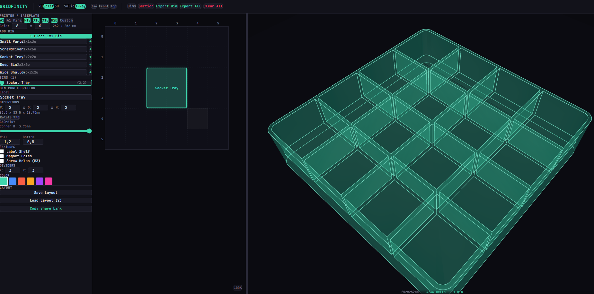
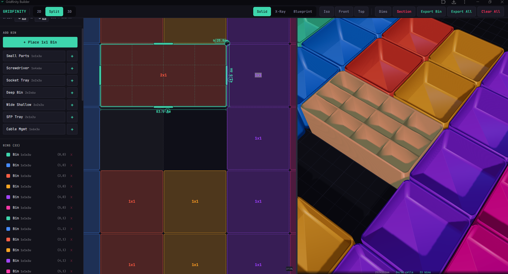
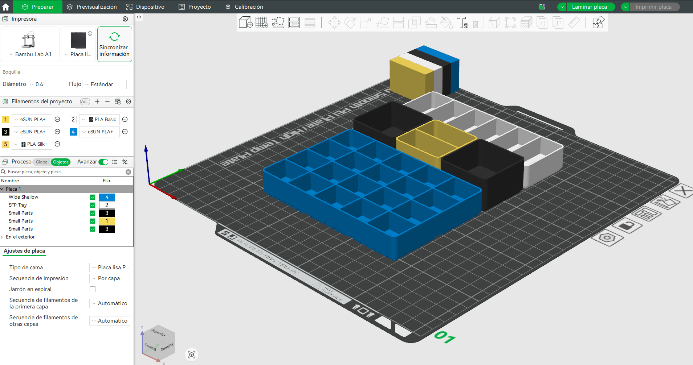
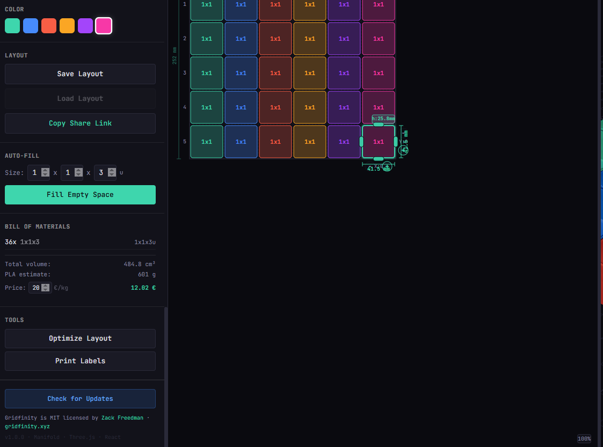

# Gridfinity Builder

**Browser-based parametric CAD tool for designing, previewing, and exporting 3D-printable Gridfinity storage layouts.**

Built for makers, 3D printing enthusiasts, and anyone who wants to organize their workspace with the Gridfinity modular storage system.

> Gridfinity is an open-source modular storage system created by [Zack Freedman](https://www.youtube.com/@ZackFreedman). This tool helps you design custom bin layouts and export them as 3MF files ready for slicing.

**Live Demo:** [https://gridfinity.securedev.codes/](https://gridfinity.securedev.codes/)



---

## Features

### Interactive 2D Grid

Design your layout on a pannable, zoomable 2D grid with real-time visual feedback.

- **Drag & drop** bins with collision detection and snap-to-grid behavior
- **Resize handles** on all 4 edges to grow or shrink bins
- **Rotate handle** for non-square bins (swap width and depth)
- **Interior dividers** with +/- controls directly on the grid
- **Measurement overlay** showing real-world mm dimensions (CAD-style cotas)
- **Placement ghost** (green = valid, red = collision)
- **Snap-back animation** when a drag is rejected

### Real-Time 3D Preview

See your bins rendered in 3D as you design, powered by Three.js and Manifold WASM CSG engine.

- **Three render modes**: Solid (PBR plastic), X-Ray (transparent + edges), Blueprint (flat white + dark outlines)
- **Camera presets**: Isometric, Front, Top — with smooth animation
- **Section view**: Cutaway mode to inspect internal geometry
- **Dimension labels**: Real-world measurements displayed in 3D
- **OrbitControls**: Rotate, pan, and zoom the 3D viewport



#### X-Ray Mode

Transparent wireframe view for inspecting bin internals, base profiles, and stacking geometry.



### Accurate Gridfinity Geometry

All bins follow the official Gridfinity specification with precise dimensions.

- **Z-profile base** with stepped chamfers for baseplate interlocking
- **Configurable corner radius** (0mm sharp to 3.75mm standard)
- **Wall & bottom thickness** control (default 1.2mm / 0.8mm)
- **Stacking lip** (+4.4mm, mirrors baseplate socket profile)
- **Label shelf** with configurable width and 45-degree angle
- **Magnet holes** (6mm diameter, 4 per cell unit)
- **Screw holes** (M3, 4 per cell unit)
- **Interior dividers** (up to 9 per axis, wall-to-wall)
- **Multi-cell bins** with correct 42mm cell spacing



### 3MF Export

Export your designs as industry-standard 3MF files, ready for PrusaSlicer, Cura, or Bambu Studio.

- **Export single bin** or **all bins** as multi-object 3MF
- **Manifold CSG** ensures watertight, printable meshes
- **Web Worker** offloads heavy geometry generation to keep the UI responsive
- Fully client-side — no server, no uploads, your data stays local

#### Ready for Bambu Studio

Exported 3MF files open directly in Bambu Studio (and other slicers) with all bins positioned on the baseplate, ready to slice and print.



### Auto-Fill & Optimization Tools

- **Auto-fill**: Fill all empty grid space with bins of a chosen size (W x D x H)
- **Optimize Layout**: Automatically find the smallest baseplate that fits all your bins using bin-packing heuristics
- **Print Labels**: Generate a printable sheet with labels for each bin (name, dimensions, grid position, features)

### Bill of Materials & Cost Estimator

Automatically generated summary of your layout with PLA cost calculation.

- Bins grouped by type with count
- Total plastic volume (cm3)
- PLA weight estimate (1.24 g/cm3 density)
- Cost calculator with configurable price per kg (default 20 €/kg)



### Save, Load & Share

- **Save/Load layouts** to browser localStorage
- **URL sharing**: Encode your entire layout in a URL hash — share a link and the recipient sees your exact design
- **Copy Share Link** button with clipboard fallback for PWA

### Progressive Web App (PWA)

Install Gridfinity Builder on your device for offline use.

- Works offline after first load (all assets cached via Service Worker)
- Installable on desktop and mobile (Chrome, Edge, Safari)
- **Check for Updates** button to force-refresh cached assets

---

## Printer & Baseplate Presets

| Preset | Grid | Real Size |
|--------|------|-----------|
| Bambu Lab A1 | 6 x 6 | 252 x 252 mm |
| Bambu Lab A1 Mini | 4 x 4 | 168 x 168 mm |
| Bambu Lab P1S | 6 x 6 | 252 x 252 mm |
| Bambu Lab X1C | 6 x 6 | 252 x 252 mm |
| Bambu Lab X1E | 6 x 6 | 252 x 252 mm |
| Bambu Lab H2D | 6 x 6 | 252 x 252 mm |
| 19" Server Rack | 10 x 8 | 420 x 336 mm |
| Custom | Any | Any |

## Bin Presets

| Name | Size | Features |
|------|------|----------|
| Small Parts | 1x1x3u | Stacking lip |
| Screwdriver | 1x4x6u | Tall, narrow |
| Socket Tray | 2x2x2u | 3x3 dividers |
| Deep Bin | 2x2x6u | Stacking lip + label shelf |
| Wide Shallow | 3x2x2u | Stacking lip |
| SFP Tray | 2x1x2u | 5 X-dividers (network modules) |
| Cable Mgmt | 1x6x3u | Long, for cable runs |

---

## Keyboard Shortcuts

| Key | Action |
|-----|--------|
| `R` | Rotate selected bin (swap W and D) |
| `Delete` / `Backspace` | Remove selected bin |
| `Escape` | Cancel placing / dragging / resizing |
| `Ctrl+Z` | Undo |
| `Ctrl+Shift+Z` | Redo |
| `Shift + Left Click` | Pan the grid |
| `Middle Mouse` | Pan the grid |
| `Scroll Wheel` | Zoom (0.2x to 5x) |

---

## Getting Started

### Prerequisites

- Node.js 18+ (LTS recommended)
- npm 9+

### Install & Run

```bash
git clone https://github.com/tunelko/gridfinity-BambuLab-3D.git
cd gridfinity-BambuLab-3D
npm install
npm run dev
```

Open [http://localhost:5173](http://localhost:5173) in your browser.

### Production Build

```bash
npm run build
npm run preview
```

### Docker

```bash
docker compose build --no-cache
docker compose up -d
```

The app will be available at `http://localhost:5173`.

---

## Architecture

```
src/
├── main.tsx                     # Entry point
├── App.tsx                      # Layout: Toolbar + Sidebar + Canvas
│
├── store/
│   └── useStore.ts              # Zustand store (bins, grid, undo/redo)
│
├── components/
│   ├── Toolbar.tsx              # Top bar: view modes, export, camera
│   ├── Sidebar.tsx              # Left panel: presets, bin list, BOM, tools
│   ├── GridCanvas2D.tsx         # 2D SVG grid with all interactions
│   ├── BinConfigurator.tsx      # Bin parameter editor
│   └── Viewport3D.tsx           # Three.js 3D preview
│
├── gridfinity/
│   ├── constants.ts             # Gridfinity dimensions & presets
│   ├── binGeometry.ts           # Manifold CSG bin generation
│   ├── baseplateGeometry.ts     # Manifold CSG baseplate generation
│   ├── profiles.ts              # Z-profile cross sections
│   └── export3mf.ts             # 3MF packaging (JSZip + XML)
│
├── hooks/
│   ├── useManifold.ts           # WASM initialization
│   └── useManifoldWorker.ts     # Web Worker interface
│
├── workers/
│   └── manifoldWorker.ts        # Background geometry generation
│
└── utils/
    ├── collision.ts             # AABB collision detection
    ├── gridMath.ts              # Screen <-> Grid coordinate math
    └── meshToThree.ts           # Manifold mesh -> Three.js geometry
```

---

## How It Works

### Geometry Pipeline

```
User changes bin config
  -> Zustand store updates
  -> Web Worker receives config
  -> Manifold WASM generates CSG mesh
  -> Mesh transferred back to main thread
  -> Converted to Three.js BufferGeometry
  -> 3D viewport updates in real-time
```

### CSG Algorithm

Each bin is built through boolean operations:

1. **Outer shell** — Rounded box (configurable corner radius)
2. **Inner cavity** — Subtracted to create walls and floor
3. **Base profile** — Stepped Z-profile added for baseplate interlocking
4. **Features** — Magnet/screw holes subtracted, dividers and lip added

### 3MF Export

The 3MF format is a ZIP archive (OPC package) containing XML mesh data. The exporter:

1. Extracts vertices and triangles from Manifold meshes
2. Serializes to 3MF XML format with proper namespaces
3. Packages with JSZip as a valid OPC archive
4. Triggers browser download

---

## Gridfinity Specification

This tool implements the [official Gridfinity specification](https://gridfinity.xyz/specification/):

| Dimension | Value |
|-----------|-------|
| Cell size | 42 x 42 mm |
| Height unit | 7 mm |
| Tolerance | 0.5 mm (0.25 per side) |
| Bin corner radius | 3.75 mm |
| Base height | 4.75 mm |
| Wall thickness | 1.2 mm |
| Bottom thickness | 0.8 mm |
| Stacking lip | 4.4 mm |
| Magnet holes | 6mm diameter, 2mm deep |
| Screw holes | M3 (3.2mm clearance) |

---

## Browser Compatibility

| Browser | Support |
|---------|---------|
| Chrome / Edge | Full (install + offline) |
| Firefox | Partial (offline, no install prompt) |
| Safari (macOS) | Partial (manual Add to Dock) |
| Safari (iOS) | Partial (Add to Home Screen) |

Requires WASM support and a modern browser with ES2020+ capabilities.

---

## License

This project is open source. Gridfinity is MIT licensed by [Zack Freedman](https://www.youtube.com/@ZackFreedman).

## Credits

- Built by [tunelko](https://github.com/tunelko)
- [Gridfinity](https://gridfinity.xyz) by Zack Freedman
- [Manifold](https://github.com/elalish/manifold) — WASM CSG engine
- [Three.js](https://threejs.org) — 3D rendering
