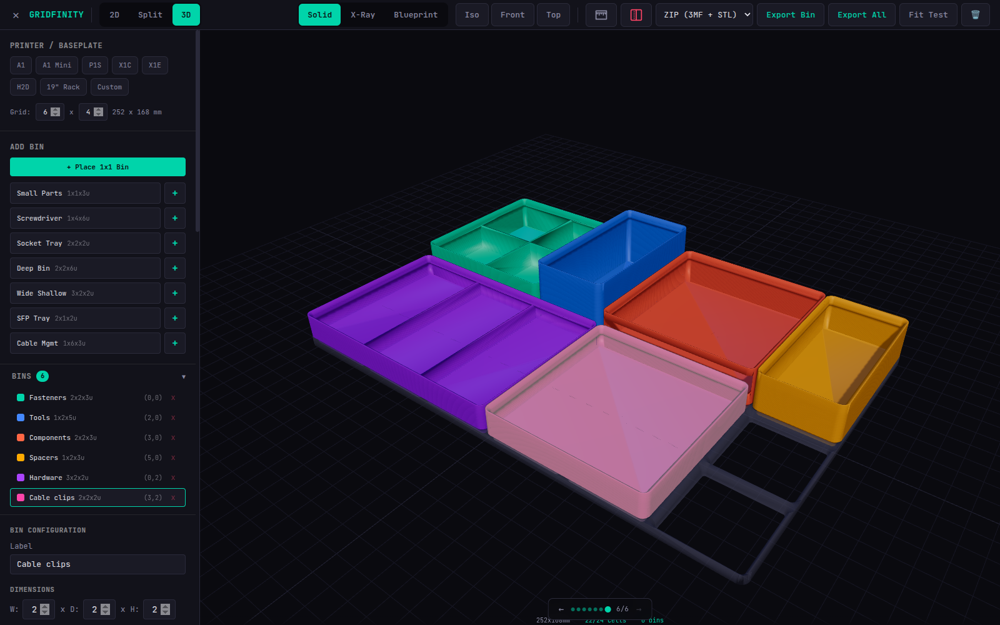
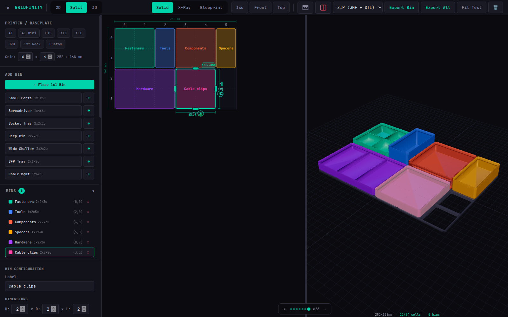
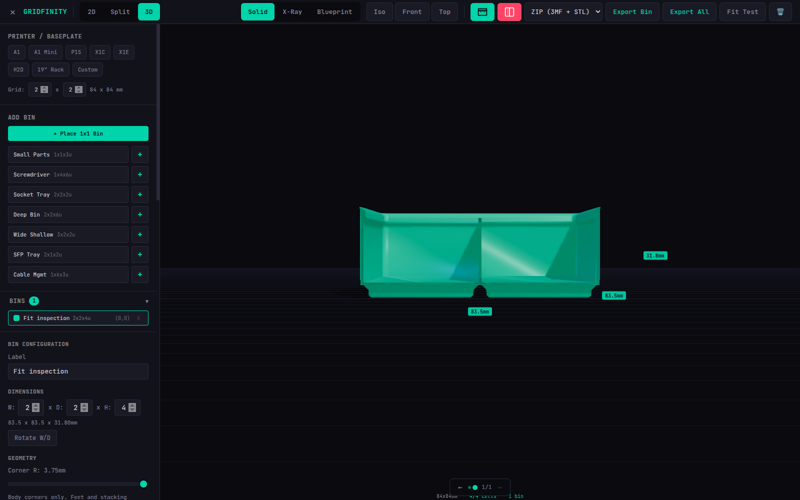

# Gridfinity Builder

Browser-based parametric CAD for designing Gridfinity storage layouts, inspecting their geometry, and exporting models for 3D printing. Geometry generation and file packaging run locally in the browser.

[Open the application](https://gridfinity.securedev.codes/) · [Documentation](https://gridfinity-docs.securedev.codes/) · [Print a fit test](docs/guide/fit-test.md)



Different footprints, heights, dividers, and label shelves in one layout. Colours distinguish bins in the editor; they are not a multi-material print assignment.

## Design and inspect

- Place, resize, rotate, and arrange bins on a 42 mm grid with collision detection.
- Configure dimensions, walls, floors, dividers, stacking lips, label shelves, and magnet or screw recesses.
- Inspect the model in Solid, X-Ray, or Blueprint mode, with camera presets, dimensions, and section views.
- Use multi-selection, copy/paste, undo/redo, presets, and layout templates.
- Save layouts in the browser, import or export JSON, and share a layout link. GitHub Gist publishing is an optional, explicitly initiated upload.
- Estimate material use and filament cost before checking the final figures in your slicer.



The same layout in the editor and 3D viewport. The preview baseplate provides a placement and fit reference; it is not included in normal bin exports.

## Export and check the fit

| Toolbar action | Download contents |
|---|---|
| Export Bin | ZIP with the selected bin as 3MF and STL |
| Export All | ZIP with one multi-object 3MF and a separate STL for each bin, preserving layout positions |
| Fit Test | ZIP with two identical 1 × 1 × 1u bins and one 2 × 1 baseplate, in both formats and separated for printing |

**ZIP (3MF + STL)** is the default format. Extract the ZIP and open `model.3mf`
or the files under `stl/`, not both together. Select **3MF only** in the toolbar
for a direct 3MF download. STL has no standard unit field: import in millimetres
at 100% scale. Each ZIP includes these instructions in `README.txt`.

The files contain model geometry, not sliced toolpaths or a configured printer/filament profile. Select those settings in your slicer. The workspace baseplate is excluded from **Export Bin** and **Export All**; only **Fit Test** includes a printable test baseplate.

Before printing a full layout:

1. Download **Fit Test**, extract the ZIP, and import `model.3mf` at 100% scale.
2. Check that each bin measures 41.5 × 41.5 × 10.8 mm and the baseplate measures 84 × 42 × 5 mm.
3. Print the three objects and check insertion, rotation, and stacking in both directions.
4. Also check against a known-good external Gridfinity baseplate.

The mating profiles follow the community dimensional reference. Body corner-radius and wall-thickness controls are independent of the mating socket. Tests cover dimensions, interference, and meshes read back from the actual 3MF archive. They do not certify a physical printer, material profile, or slicer version. No independent 3MF conformance validator or automated slicer import is currently part of the test suite.



Section view of a 2 × 2 × 4u bin. Its displayed 31.8 mm height includes the 3.8 mm printed stacking lip. The cutaway is a viewing aid and does not cut the exported model.

See [export behaviour](docs/features/export.md), [download verification](docs/architecture/export-validation.md), [fit-test instructions](docs/guide/fit-test.md), and the [geometry verification record](docs/architecture/fit-validation.md).

## Run locally

Use Node.js 24 and its bundled npm, matching the CI and container builds. The browser needs WebAssembly, Web Workers, and WebGL 2 for the 3D viewport.

```bash
git clone https://github.com/tunelko/gridfinity-BambuLab-3D.git
cd gridfinity-BambuLab-3D
npm ci
npm run dev
```

Open [localhost:5173](http://localhost:5173). Keep the development server local; use the production build for a public deployment.

### Build and test

```bash
npm test
npm run build
npm run export:fit-test
npm ci --prefix docs
npm run build --prefix docs
```

The application build is written to `dist/`, the documentation build to `docs/.vitepress/dist/`, and the printable test to `artifacts/gridfinity-fit-test.3mf`. Generated build and fit-test artifacts are not committed.

### Run with Docker

```bash
docker compose build app docs
docker compose up -d app docs
```

The application is served on port 5173 and documentation on port 4173. Both containers serve static production files through nginx. See [Docker setup](docs/guide/docker.md) for operational details.

## Documentation

| Topic | Reference |
|---|---|
| First layout and local setup | [Getting started](docs/guide/getting-started.md) |
| Parameters and dimensions | [Bin configuration](docs/features/bin-configuration.md) · [Dimensional reference](docs/reference/specification.md) |
| Editing and inspection | [2D editor](docs/features/2d-grid.md) · [3D preview](docs/features/3d-preview.md) |
| Output files and validation | [ZIP, 3MF and STL export](docs/features/export.md) · [3MF structure](docs/architecture/3mf-format.md) |
| Presets and shortcuts | [Printer presets](docs/reference/printer-presets.md) · [Bin presets](docs/reference/bin-presets.md) · [Keyboard shortcuts](docs/reference/keyboard-shortcuts.md) |
| Implementation | [Project structure](docs/architecture/project-structure.md) · [Geometry pipeline](docs/architecture/geometry-pipeline.md) |

## Project and acknowledgements

Maintained by [tunelko](https://github.com/tunelko). Gridfinity was created by [Zack Freedman](https://www.youtube.com/@ZackFreedman). The application uses React, TypeScript, Three.js, Manifold 3D, Zustand, Vite, and JSZip.

Screenshots were captured from the application production build on 12 September 2026 in Chromium at 1600 × 1000 pixels. They show example layouts, not photographs of printed parts or evidence of slicer certification. See [documentation capture notes](docs/architecture/documentation-validation.md) for provenance and verification.
